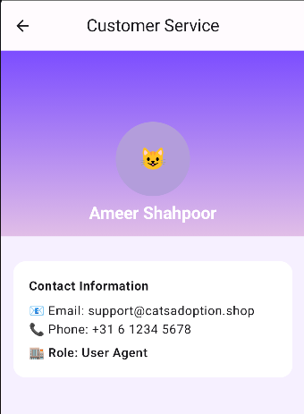

# Documentation — Member 4 (Ameer) — catsadoption_shop

**Role:** Backend API Development & IDOR Vulnerability Demonstration (Ameer)

**Scope Covered:**
Implementation of insecure API endpoints for demonstration purposes, simulation of an Insecure Direct Object Reference (IDOR) vulnerability, and full exploitation walkthrough using Burp Suite.

---

## Project Overview
This module focuses on the backend portion of the CatsAdoption Shop application.
To support the security demonstrations required in the course, an intentionally insecure API endpoint was implemented that exposes user profile information withoutany authentication or authorization checks.

The purpose of this module is to:

- Provide a functional API backend for the mobile app

- Introduce an intentional **IDOR** vulnerability

- Demonstrate how a malicious actor can exploit this flaw to access other users’ private data

- Document each stage of the exploitation, from setup to proof of impact

This vulnerability is commonly found in real-world mobile apps, especially when object IDs are passed directly from the client to backend without validation.

---

## Summary
The backend development and security demonstration are divided into three main parts:
1. **Backend API Development**
   A simple FastAPI backend was created to return user profile data (name, birthdate, email, phone number, adopted cats list).
   The endpoint `/users/{user_id}` returns data based only on the user ID being passed — **without verifying the requester’s identity.**
2.  **Intentional Vulnerability**
    The `/users/{id}` endpoint is intentionally left unprotected, creating an **Insecure Direct Object Reference (IDOR)**.
    Any user can modify the ID in the URL to retrieve another user's data.
3.  **IDOR Exploitation**
    Using Burp Suite, the request from the Android application was intercepted, the `user_id` value was modified, and the backend returned data belonging to other users.
    The app then displayed this unauthorized data in the UI, proving the vulnerability end-to-end.

---

## Deliverables and Purpose

### Deliverable 1 — Functional User Profile API

#### Objective:
Provide user profile data to the Android app.

#### Key Files:

- **database.py** — Contains static demo users

- **models.py** — Defines UserProfile and AdoptedCat structures

- **main.py** — Implements the /users/{id} endpoint

- **InsecureApiClient.kt** — Android networking client consuming the endpoint

---

### Deliverable 2 — IDOR Vulnerability Demonstration

#### Objective:
Demonstrate how modifying a user ID in an API request exposes private data of other users.

#### Behavior:

- Authorized user requests their own profile

- Attacker intercepts the request via Burp Suite

- Attacker changes `/users/1` → `/users/2`

- Backend returns private data for user 2

- Android app displays this unauthorized data

---

## Environment 

This section explains how the testing environment was prepared before performing the IDOR vulnerability analysis.

### How to Run the Backend Server
For the Android application to get user data from the custom API, the Python backend server must be running on your computer.

#### Step 1: Navigate to the Correct Directory
First, open the terminal in Android Studio and navigate into the `cats_backend` folder.

```sh
cd cats_backend
```

#### Step 2: Run the Server
Once you are inside the `cats_backend` directory, run the following command:

```sh
uvicorn main:app --host 0.0.0.0 --port 8000
```

This command starts the server and makes it visible to your Android emulator. You should see output confirming that the server is running.

#### Explanation of the Command
*   **`uvicorn`**: This is the program we use to run our Python web server.
*   **`main:app`**: This tells Uvicorn what to run.
    *   `main`: "Look for a file named **`main.py`**."
    *   `app`: "Inside that file, find the FastAPI object named **`app`**."
*   **`--host 0.0.0.0`**: This tells the server to listen for connections from **any device** on the network. This is required for the Android emulator to be able to connect to it.
*   **`--port 8000`**: This tells the server to listen on **port `8000`**, which matches the port number the Android app is configured to use.

### Android Emulator Proxy Configuration
The Android emulator was configured to route all HTTP traffic through Burp Suite so that API calls could be intercepted.


### Burp Suite Proxy Listener Configuration
Burp Suite was set to listen for incoming traffic from the emulator.

- Interface: All interfaces (0.0.0.0)

- Port: 8080
  


### Successful Interception of App Traffic
After configuring both the emulator and Burp Suite, the app's network traffic appeared in Burp’s HTTP history, confirming that interception was working.


## Exploitation of IDOR Vulnerability

### Triggering the Vulnerable Request
To demonstrate the IDOR issue, the attacker begins by navigating inside the mobile application to the Customer Service section.
This action automatically triggers an API call to the backend:

`GET /users/1`
This endpoint returns the profile information of the default user with ID 1.
The application blindly assumes this ID is valid and does not verify whether the requester should have access.

   

### Interception of the Request Using Burp Suite
With Burp Suite running as a proxy, the request is captured and displayed inside the Proxy → **HTTP history** tab.
At this moment, the attacker can fully view and modify the HTTP request before it reaches the backend.

This lack of endpoint-level authorization makes the app highly vulnerable.


### Tampering With the User ID Parameter
The attacker edits the request by changing the user ID parameter inside the URL.
For example, modifying:

**/users/1** to **/users/2** or any existing user.

The backend performs no validation, so it returns the profile data of the requested user ID — even though the attacker is not authenticated as that user.


### Unauthorized Access to Other Users’ Data

After forwarding the modified request, Burp Suite displays the backend response containing the personal data of the new user ID.

The mobile app also loads and displays this unauthorized profile information.

This confirms a successful exploitation:

The attacker is able to access any user’s profile simply by changing the numeric ID in the request.


### Security Impact of the Vulnerability
This flaw demonstrates a **critical Broken Access Control issue:**

- Anyone using the application can enumerate user IDs.

- No authentication or authorization is required.

- User data can be accessed by guessing IDs (1, 2, 3, …).

- Sensitive customer information becomes fully exposed.

- An attacker can harvest all profiles without detection.

In real-world systems, this would be categorized as a **High** or **Critical** severity vulnerability.

---

**End of documentation — Member 4 (Ameer)**
