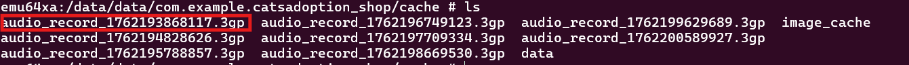
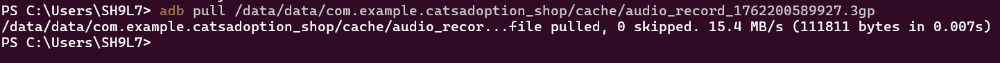
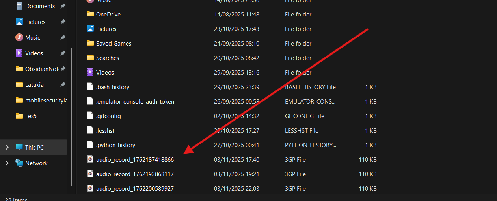
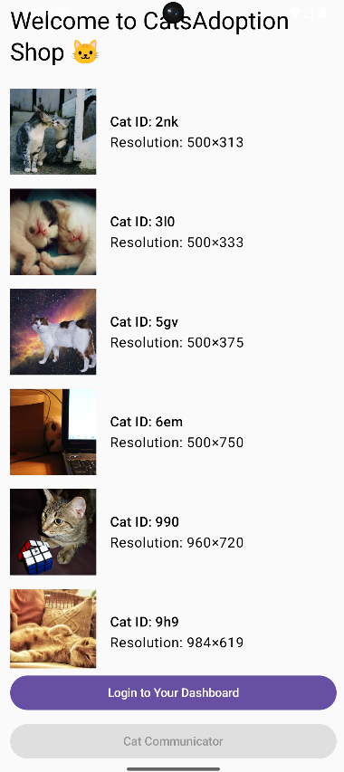
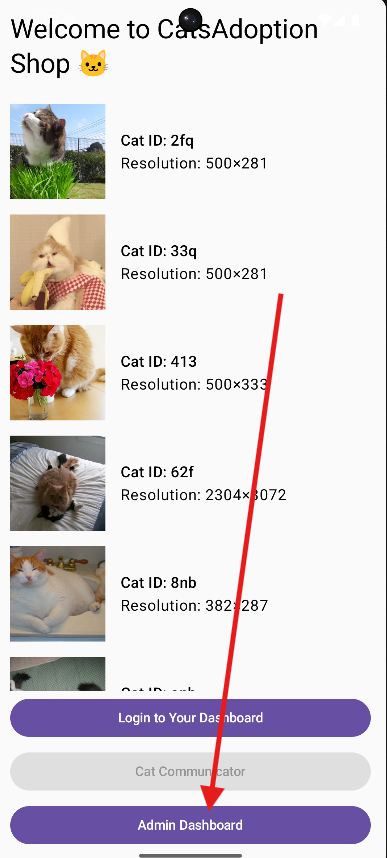
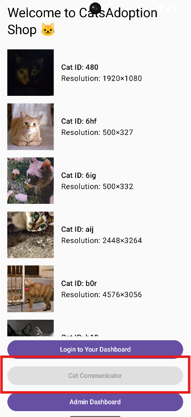

# Documentation — Member 3 (Zeini Ddin) — Vulnerabilities & Malware Integration

**Role:** Vulnerabilities & Malware Integration

**Deliverables Covered:**
* Malware implemented and functional.
* Modifiable functionality via decompile/recompile.
* Root detection logic + Magisk bypass demo.
* Documentation section: "Malware & Root Security."

---

## Project Overview

The **Member 3** module introduced intentional security weaknesses and malicious functionality into the *catsadoption\_shop* application. The objective was to provide robust targets for offensive testing (Member 4), focusing on stealth, persistence, and bypassable security mechanisms. The implementation is based on **Kotlin** and **Jetpack Compose**.

---

## Summary

Two major vulnerability features were successfully integrated:

1.  **Malware Integration (Mic Recording):** Implementation of persistent, stealthy audio eavesdropping disguised as a benign UI feature.
2.  **Anti-Tampering & Bypass:** Insertion of a hardcoded flag for easy feature unlocking via APK recompilation, and a basic root detection system designed for a successful Magisk bypass demonstration.

---

## Deliverables and Purpose

### Feature 1 — Persistent Audio Eavesdropping (Malware)

**Objective:** Implement malware functionality that runs persistently in the background to exfiltrate ambient audio, demonstrating a core security threat.

**Main Files & Components:**
* `CatListingsScreen.kt`: Contains the visible "Cat Communicator" button (the benign cover).
* `PermissionCheckActivity.kt`: Handles the `RECORD_AUDIO` runtime permission request.
* `StealthAudioWorker.kt`: A `CoroutineWorker` scheduled for periodic background execution.
* `recordAudioForTime()` function: Core logic using `MediaRecorder` to capture audio.

**Flow & Persistence:**
1.  User clicks "Cat Communicator" and grants **`RECORD_AUDIO`** permission.
2.  The worker is scheduled via `WorkManager` using a `PeriodicWorkRequestBuilder`.
3.  The task runs every **15 minutes** (`TimeUnit.MINUTES`), recording 60 seconds of audio.
4.  Audio files (`audio_record_[timestamp].3gp`) are saved to the app's internal cache: `/data/data/com.example.catsadoption_shop/cache/`.

**Exploitation Method:**
Retrieval of the stolen data requires **root access** to pull files from the protected cache directory using `adb pull`.

---

### Feature 2 — Modifiable Functionality via Decompilation

**Objective:** Insert a feature that is conditionally hidden by a simple hardcoded boolean, proving the vulnerability of client-side logic to static analysis and recompilation.

**Main Files & Components:**
* `AppConfig.kt`: Contains the intentional vulnerability: `const val IS_ADMIN_ENABLED = false`.

* `CatListingsScreen.kt`: Conditionally displays the **"Admin Dashboard"** button based on the `IS_ADMIN_ENABLED` flag.

* `AdminDashboardScreen.kt`: The target screen displaying the success message.

**Exploitation Method:**
1.  Attacker (Member 4) decompiles the APK (e.g., using **apktool**).
2.  The attacker finds `AppConfig.kt` or its compiled equivalent.
3.  The attacker changes `IS_ADMIN_ENABLED = false` to `IS_ADMIN_ENABLED = true`.
4.  The attacker recompiles and resigns the APK.
5.  On launch, the hidden **"Admin Dashboard"** button appears, and clicking it displays the "Exploit Succeeded!" message, confirming the bypass.

---

### Feature 3 — Bypassable Root Detection Logic

**Objective:** Implement a security check using common, easily detectable methods to set up a demonstration of root detection and its bypass using modern tools like Magisk.

**Main Files & Components:**
* `RootUtils.kt`: Implements the `isDeviceRooted()` function, which checks for:
    * Existence of common **`su` binaries** (`/system/bin/su`, etc.).
    * Presence of **`Superuser.apk`**.
    * Presence of **test-keys** in build tags.
* `CatListingsScreen.kt`: The **"Cat Communicator"** button is disabled (`enabled = !isRooted`) if root is detected.

**Demonstration and Bypass:**
* **Root Detected:** When run on a standard rooted device (no root-hiding), `isDeviceRooted()` returns `true`. The "Cat Communicator" button is **disabled**, and clicking it displays a "Security violation detected" Toast message.

* **Bypass with frida script: `frida -U --codeshare dzonerzy/fridantiroot -f com.example.catsadoption_shop`
* **Bypass with Magisk:** By enabling **Zygisk** and adding the app's package name (`com.example.catsadoption_shop`) to the **DenyList** within the Magisk Manager, the root-hiding tool intercepts the check calls. The `isDeviceRooted()` function is tricked into returning `false`, successfully **enabling** the "Cat Communicator" button and allowing the malware to be scheduled.

---
**End of documentation — Member 3 (Zeini Ddin)**