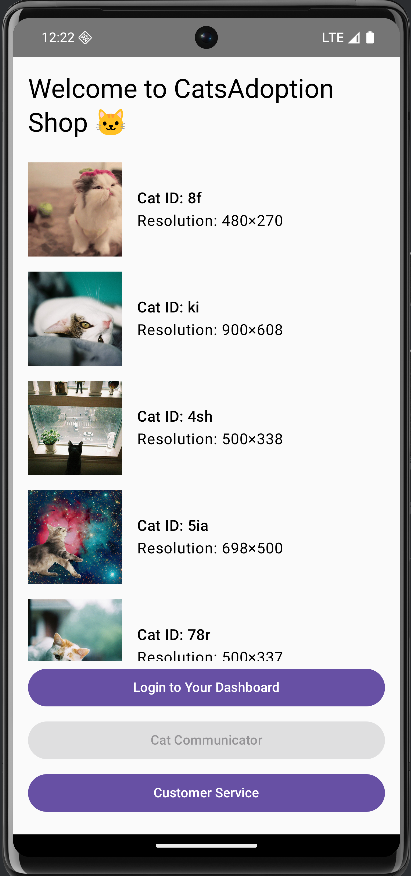
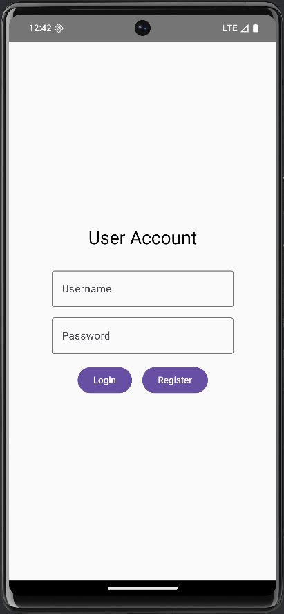
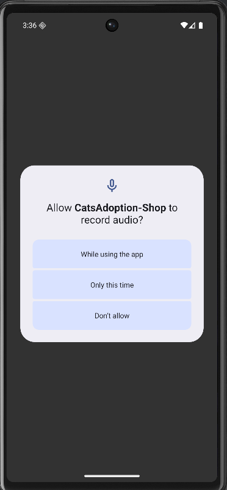
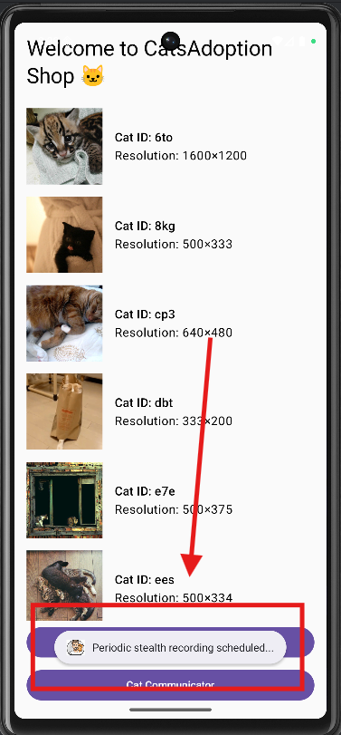
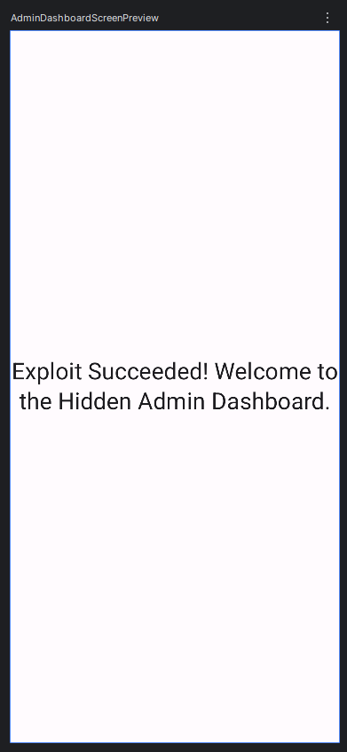
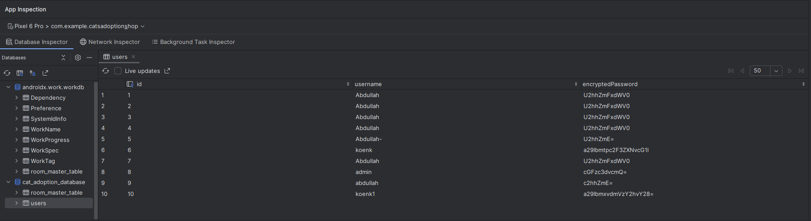
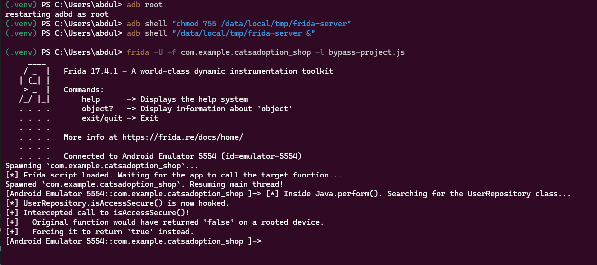
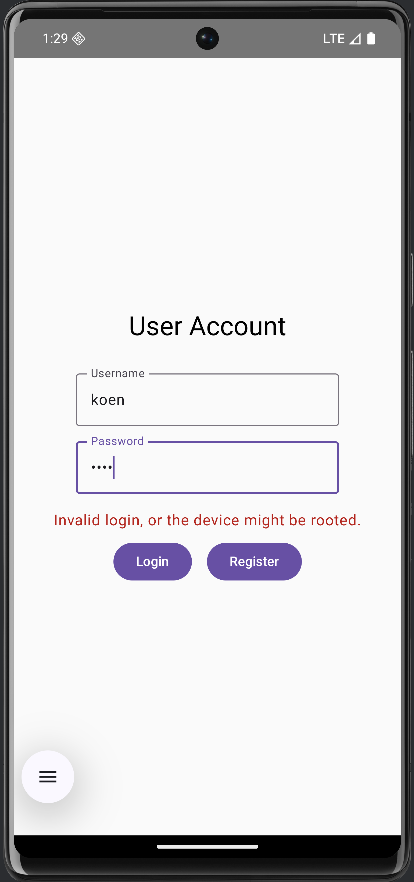

# Mobile Security project - G30 - Documentation

## Group members

1. Moestafa Alhaj Abdo
2. Abdullah Shafaquet
3. Zeiniddin Fatayrji
4. Ameer Shahpoor

## Project summary

The "Cats Adoption Shop" is an Android application built using Kotlin. The app allows users to browse cat listings fetched from a public API, register for an account, and log in to a personal dashboard. The project intentionally implements both secure practices (e.g., SQL injection-safe Room database, SSL pinning) and security vulnerabilities (e.g., weak credential storage, bypassable root detection using Frida, IDOR) to showcase both secure functions and intentionally added vulnerabilities.

## Requirements

### ℹ️ Legend

- ✔️ = Implemented
- ❌ = Not implemented
- ⌛ = Work in progress

| Status | Description                         | Details                                                                                                                                                             |
| ------ | ----------------------------------- | ------------------------------------------------------------------------------------------------------------------------------------------------------------------- |
|        | **Application**                     |                                                                                                                                                                     |
| ✔️     | 2 UI screens                        | There are multiple screens, all of which branch out from the **Cat Listing Screen**                                                                                 |
| ✔️     | Secure API request                  | The secure API is called with the standard API after login and displays data only if certificate validation succeeds, otherwise showing an error to prevent tampering or interception. |                                                                                                                                                                    |
| ✔️     | API request with IDOR               | A FastAPI backend endpoint (`/users/{id}`) was created that returns user data based on an ID from the URL, without performing any authorization checks.             |
| ✔️     | Connection to room database         | A Room Database was made, where the users information (ID, Username, Password) is stored                                                                            |
| ⌛     | Secure storage                      |                                                                                                                                                                     |
|        |                                     |                                                                                                                                                                     |
|        | **Security**                        |                                                                                                                                                                     |
| ✔️     | Unsafe storage                      | The users password is stored using base64, a very recognizable method of encryption                                                                                 |
| ✔️     | Malware                             | The Cat Communicator feature asks for microphone permissions and utilizes WorkManager to persistently schedule ambient audio recording (1 minute every 15 minutes). |
| ✔️     | Frida functionality                 | We provided 2 methods of a Frida bypass, one self written and the other from online to showcase how we can use both to break through                                |
| ✔️     | Detect root and block functionality | We made a **Root Detector** which checks the **su binaries** to check if the device is rooted or not                                                                |

## Overview app

*Describe the implementation of the following topics.*

### Screenshots

*Give screenshots for every screen in the application. Give each screen an unique name.*



This is the screen you see on startup, the Cat Listing Screen, which shows a list of available cats for adoption. The bottom of the screen contains three primary buttons (visible in the screenshot) that lead to other parts of the app:

- **Login to Your Dashboard**: Navigates to the Login / Registration screen. After a successful login the app navigates to the User Dashboard.



- **Cat Communicator**: This button is guarded by a root-detection check and is disabled when the device is detected as rooted (the screenshot shows it disabled/greyed out). The intended flow requests microphone permission (see `PermissionCheckActivity`) and schedules the communicator/recording work; in `MainActivity` the communicator click handler is currently a placeholder.





- **Customer Service**: This button navigates to the User Profile screen for a hardcoded user. The `UserProfileScreen` shows the title "Customer Service" when the loaded profile has role `User Agent`. Because the listings screen navigates to a fixed `userId` this demonstrates the IDOR-style route usage in the app (hardcoded/profile-by-id behavior).


Additionally, the app can show an **Admin Dashboard** button when `AppConfig.IS_ADMIN_ENABLED` is true; that button navigates to `admin_dashboard`.



### Secure API request

*Request to server x retrieving JSON in the following format displayed in screen x.*

The secure API is integrated directly into the User Dashboard. Upon user authentication, the dashboard triggers two parallel coroutine tasks:

- one retrieves data from the standard API,
- the other queries the secure endpoint.

If the certificate validation succeeds, the secure API response is displayed normally. If the validation fails, such as during attempted interception or manipulation, then the interface presents a clear and explicit error message. This implementation ensures that any attempt to intercept, alter, or downgrade the request must not compromise or modify the secure endpoint’s behavior.

### API request with IDOR

An insecure API endpoint was intentionally created to demonstrate an Insecure Direct Object Reference (IDOR) vulnerability.

- **Type of Data:** The endpoint exposes sensitive user profile information, including name, birthdate, email, and phone number.
- **Implementation:**
  - A **FastAPI backend** (`cats_backend/`) was created with a `/users/{user_id}` endpoint.
  - This endpoint retrieves user data based *only* on the `user_id` provided in the URL, without performing any authentication or authorization checks.
  - The Android app uses an insecure client (`InsecureApiClient.kt`) to call this endpoint, navigating to `userProfile/1` when the "Customer Service" button is clicked.
- **Vulnerability:** An attacker can intercept this request using a proxy like Burp Suite and change the user ID in the URL (e.g., from `/users/1` to `/users/2`). Because the backend does not validate that the requester is authorized to view the requested profile, it will return the private data of any valid user ID, which is then displayed in the app. This demonstrates a critical broken access control flaw.

### Room database

*Type of data stored in the database used in screen x and displayed in screen y.*

A local database was implemented using the Android Room Persistence Library to store user account information.

- **Type of data stored:** User credentials, the users `id`, `username` and `encryptedPassword`.
- **Implementation:** The `AppDatabase.kt` defines the database, which contains a `users` table based on the `User` entity. The `UserDao` interface provides safe access for creating and retrieving users.
- **Usage:** The database is used by the **Login Screen**. When a user clicks "Register", their details are written to the database. When they click "Login", their info gets queried to the database, so it can verify the users existence and password.

### Secure storage

*Type of data stored used in screen x and displayed in screen y.*

### Unsecure storage

*Type of data stored used in screen x and displayed in screen y.*

An intentional vulnerability was introduced in how user passwords are stored to demonstrate the risk of using weak protection for sensitive data.

- **Type of Data:** User passwords.
- **Implementation:** A `WeakEncryption.kt` utility object was created. Instead of using a strong, one-way cryptographic hash function, it uses simple **Base64 encoding** to "encrypt" the password before storing it in the local Room database.
- **Vulnerability:** Base64 is an encoding scheme, not encryption. It is designed for data transport, not security, and is trivially reversible. An attacker who gains access to the database file (e.g., on a rooted device or via a backup) can easily decode the `encryptedPassword` column to reveal the user's original plaintext password, completely compromising the account.


**Example:** User: koenk1, encryptedPassword: a29lbmxvdmVzY2hvY28=, decryptedPassword: koenloveschoco

### Malware

*Implementation of malware.*

### Frida

*Detail implementation of Frida - Abdullah*

A Frida script was developed to demonstrate the bypass of a client-side security control at runtime.

- **Target:** The `isAccessSecure()` method within the `UserRepository.kt` class. This method is designed to check for a rooted device and block data access if one is detected.
- **Implementation (`bypass.js`):** A JavaScript script was written to hook into the running application process. It uses `Java.perform` to get a handle to the `UserRepository` class and then replaces the implementation of the `isAccessSecure()` method with a new function that simply returns `return true;`.
- **Execution:** The attack is launched from a command line using the Frida tools. The script is injected into the app process at startup, effectively neutralizing the root check before it can ever be executed during a login attempt.
- **Commands Used:**

  ```
  adb root
  adb push "C:\Users\abdul\Documents\Howest\Cybersecurity_Y2\MobileSec\frida-server-17.4.0-android-x86_64\frida-server" /data/local/tmp
  adb shell "chmod 755 /data/local/tmp/frida-server"
  adb shell "/data/local/tmp/frida-server &"

  frida -U -f com.example.catsadoption_shop -l bypass-project.js
  ```

- **Frida-bypass:**

  ```
  // Frida script to bypass the root check in the CatsAdoption-Shop app

  console.log(
  "[*] Frida script loaded. Waiting for the app to call the target function..."
  );

  // Use setTimeout to ensure Java classes are loaded before we try to hook them
  setTimeout(function () {
  // Java.perform is the main entry point for any Frida script interacting with Java code
  Java.perform(function () {
      console.log(
      "[*] Inside Java.perform(). Searching for the UserRepository class..."
      );

  // 1. Get a handle to the UserRepository class
  const UserRepository = Java.use(
    "com.example.catsadoption_shop.data.UserRepository"
  );

  // 2. Hook the target method: isAccessSecure()
  UserRepository.isAccessSecure.implementation = function () {
    // Log a message to the Frida console to confirm our hook is working
    console.log("[+] Intercepted call to isAccessSecure()!");
    console.log(
      "[+]   Original function would have returned 'false' on a rooted device."
    );
    console.log("[+]   Forcing it to return 'true' instead.");

    // 3. Force the function to return 'true'
    // This bypasses the root check completely.
    return true;
  };

  console.log("[*] UserRepository.isAccessSecure() is now hooked.");
  });
  }, 0);
  ```



*Detail implementation of Frida - Zeini*

An online frida script was used here to bypass all root, superuser, build tags detection.

- **Target:** The `isDeviceRooted()` function in `RootUtils.kt`, which checks for the presence of `su` binaries, `Superuser.apk`, and test-keys in build tags. This function is used to disable the "Cat Communicator" button if root is detected.
- **Execution:** The root detection can be bypassed at runtime using a public Frida anti-root script or Magisk root-hiding features.
- **Frida Bypass:**
- The following command is used to launch the app with a Frida anti-root script:


    ```
    frida -U --codeshare dzonerzy/fridantiroot -f com.example.catsadoption_shop
    ```

- This script hooks common root detection methods, forcing them to return values indicating a non-rooted device, thus re-enabling the "Cat Communicator" button.
- **Demonstration:**
- On a rooted device, the button is disabled and a security violation message is shown.
- With Frida bypass active, the button is enabled and the malware feature (audio recording) can be scheduled, demonstrating the effectiveness of runtime and root-hiding bypasses.


### Root

*Implementation of the detecting root and block functionality.*

The application implements root detection to block functionality on compromised devices.

- **Implementations:**
  - A `RootDetector.kt` utility was created. Its `isDeviceRooted()` function checks for the existence of common root-related files, such as the `su` binary in paths like `/system/bin/su` and `/system/xbin/su`.
  - This check is called from the `UserRepository.isAccessSecure()` method before any login database query is performed.
- **Behaviour:** If the `isDeviceRooted()` function returns `true`, `isAccessSecure()` also returns `false`. This causes the login process to fail, and the user is shown a generic error message ("Invalid login, or the device might be rooted."). This blocks the login functionality on rooted devices.



## Link to Panopto video

https://howest.cloud.panopto.eu/Panopto/Pages/Viewer.aspx?id=6a5dcde1-e07b-46a1-abce-b3b500c60904

## Repositories

- Code
  - https://gitlab.ti.howest.be/ti/2025-2026/s3/mobilesecurity/students/group-30/catsadoptionshop
- APKs
  - Base: https://gitlab.ti.howest.be/ti/2025-2026/s3/mobilesecurity/students/group-30/catsadoptionshop/-/blob/main/APK/CatAdoptionShop.apk
  - Injected and edited: https://gitlab.ti.howest.be/ti/2025-2026/s3/mobilesecurity/students/group-30/catsadoptionshop/-/blob/main/APK/Aligned_Injected_CatAdoptionShop.apk